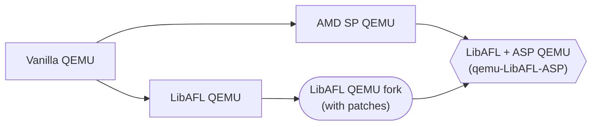

# qemu-LibAFL-ASP
Combining LibAFL's QEMU patch with AMD SP's QEMU patch.

## Structure

```mermaid
flowchart LR;

VanillaQemu["Vanilla QEMU"];
ASPQemu["AMD SP QEMU"];
LibAFLQemu["LibAFL QEMU"];
ForkLibAFLQemu(["LibAFL QEMU fork\n(with patches)"]);
LibAFLPSPQemu{{"LibAFL + ASP QEMU\n(qemu-LibAFL-ASP)"}};

VanillaQemu --> ASPQemu;
ASPQemu --> LibAFLPSPQemu;
VanillaQemu --> LibAFLQemu;
LibAFLQemu --> ForkLibAFLQemu;
ForkLibAFLQemu --> LibAFLPSPQemu;
```
