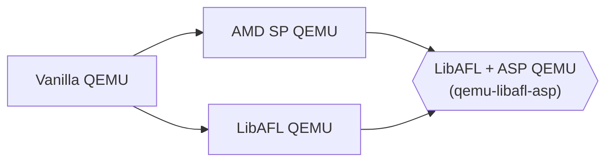

# qemu-libafl-asp
Combining LibAFL's QEMU patch with AMD SP's QEMU patch.

## Structure

### Repos
- [Vanilla QEMU](https://github.com/qemu/qemu)
- [AMD SP QEMU](https://github.com/pascalharp/qemu)
- [LibAFL QEMU](https://github.com/AFLplusplus/qemu-libafl-bridge)

## How to merge
1. Setup remotes
```
git remote add qemu-asp git@github.com:pascalharp/qemu.git
git remote add qemu-libafl-bridge git@github.com:AFLplusplus/qemu-libafl-bridge.git
```

2. Fetch remotes
```
git fetch qemu-libafl-bridge
git fetch qemu-asp
```

3. Create branch for qemu-libafl-bridge base
```
git checkout -b base_qemu_libafl_bridge
```

4. Merge LibAFL QEMU into branch
```
git merge ddb71cf --allow-unrelated-histories
```
Solve merge conflicts!

5. Create branch for merged version with qemu-asp
```
git checkout -b merged_qemu_asp
```

6. Merge ASP QEMU into repo
```
git merge remotes/qemu-asp/zentesla
```
Solve merge conflicts!

7. Create branch for additional patches
```
git checkout -b additional_patches
```

8. Copy README.md from merge\_instructions branch into main

9. Apply additinal patches

7. Merge into main branch
```
git checkout main
git merge merged_qemu_asp --allow-unrelated-histories
```

## License

<sup>
This project extends the QEMU emulator, and our contributions to previously existing files adopt those files' respective licenses; the files that we have added are made available under the terms of the GNU General Public License as published by the Free Software Foundation, either version 2 of the License, or (at your option) any later version.
</sup>

<br>
